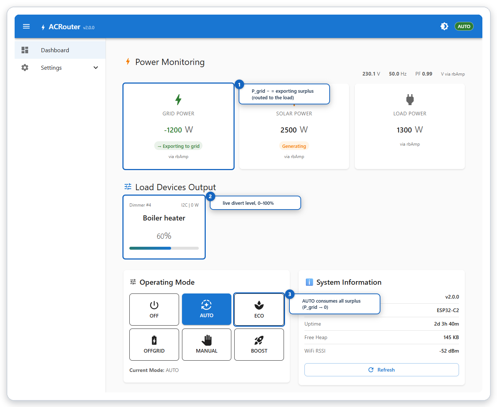
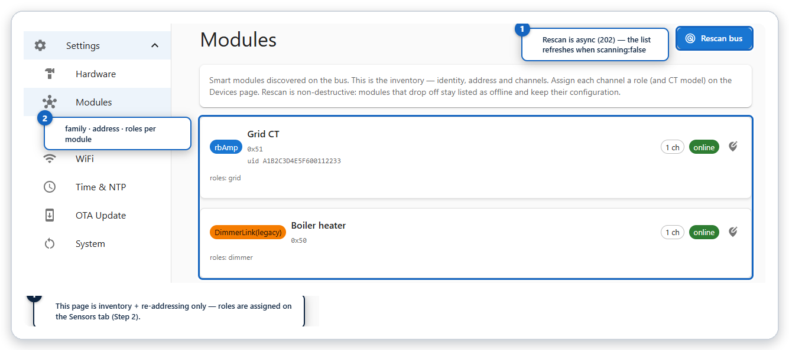

# ACRouter — Open Source Solar Router Controller

<p align="center">
  <strong>Intelligent AC Power Router for Solar Energy Management</strong>
</p>

<p align="center">
  <a href="#what-is-acrouter">About</a> •
  <a href="#features">Features</a> •
  <a href="#web-app">Web App</a> •
  <a href="#hardware">Hardware</a> •
  <a href="#quick-start">Quick Start</a> •
  <a href="#operating-modes">Modes</a> •
  <a href="#documentation">Docs</a> •
  <a href="#contributing">Contributing</a>
</p>

<p align="center">
  
  
  
  
</p>

---

## What is ACRouter?

**ACRouter** is an open-source controller that automatically redirects excess solar energy to resistive loads (like water heaters) instead of exporting it to the grid. It helps you maximize self-consumption of your solar power and reduce electricity costs.


### Why ACRouter?

| Problem | Solution |
|---------|----------|
| Excess solar energy exported to grid at low rates | Route it to heat water or other loads |
| Expensive battery storage systems | Use thermal storage (water heater) instead |
| Complex commercial solutions | Simple, open-source, DIY-friendly |
| Fixed on/off control wastes energy | Smooth phase-angle dimming for precise control |

---

## v2.0 — Smart-Module Architecture

ACRouter v2.0 moves sensing and dimming off the host board and onto **smart modules on an I2C bus** (plus optional ESP-NOW wireless nodes). The ESP32 host runs the control logic; it no longer does on-chip ADC sensing or direct TRIAC dimming.

- **Sensing → rbAmp modules** — current/voltage over I2C, with per-channel roles (grid / solar / load / voltage). Optional **ESP-NOW** wireless sensor nodes (ESP32-tier).
- **Dimming → DimmerLink modules** — phase-cut AC dimmers driven over I2C.
- **Source-agnostic control loop** — the router consumes merged measurements regardless of origin.
- **Two targets, three profiles** — ESP32 (full) and ESP32-C2 (a small, low-cost target) in HTTP or headless MQTT builds, selected at compile time.

---

## Features

### ⚡ Smart Power Monitoring
- Current & voltage from **rbAmp I2C smart modules** (per-channel grid/solar/load/voltage roles)
- Optional **ESP-NOW** wireless sensor nodes (ESP32-tier)
- Signed grid power (+import / −export) for true balance/direction sensing
- ~5 Hz merged-measurement control loop on a dedicated, isolated RTOS task

### 🎛️ Intelligent Load Control
- Phase-cut AC dimming via **DimmerLink I2C** smart dimmers (0–100% smooth control)
- Seven operating modes for different scenarios (see below)
- Priority-based multi-load cascade; relay outputs for on/off loads
- Sensor-loss failsafe — the load fails toward off if a regulating measurement is lost

### 📱 Configuration & Integration
- Built-in WiFi Access Point for first-time setup
- **External web app** with real-time dashboard, module management, and mode control (see [Web App](#web-app) below)
- **REST API** (`/api/*`) — see [Web API GET](docs/08_WEB_API_GET_EN.md) / [Web API POST](docs/09_WEB_API_POST_EN.md)
- **MQTT** client with LWT + **Home Assistant auto-discovery**; config-over-MQTT for headless devices
- Serial console for advanced users
- Settings stored in non-volatile memory

### 🧩 Compile Tiering
- **ESP32-full** — HTTP + MQTT + OTA + ESP-NOW
- **C2-HTTP** — ESP32-C2 with the on-device HTTP/REST API
- **C2-MQTT** — headless ESP32-C2, provisioned and controlled entirely over MQTT
- `/api/info` reports the build's `features` so clients can adapt

---

## Hardware

ACRouter runs on **ESP32** and **ESP32-C2 (ESP8684)** host boards and talks to smart modules over I2C.

| Component | Role |
|-----------|------|
| **ESP32 / ESP32-C2 host** | Runs the control loop, web/MQTT/OTA, and the I2C module bus (4 MB flash) |
| **rbAmp module** | Current/voltage sensing over I2C. Use a **voltage-capable** variant for the `grid` role (needed for signed power / balance modes) |
| **DimmerLink module** | Phase-cut AC dimmer, I2C slave (default address `0x50`) |
| **ESP-NOW nodes** *(optional, ESP32-tier)* | Wireless sensor / output nodes |

> 💡 ACRouter is designed to work with hardware from [rbdimmer.com](https://rbdimmer.com) and any open-source DIY modules that speak the same protocols.

### CT models

The firmware ships presets for the SCT-013 current-transformer family: **5 A, 10 A, 20 A, 30 A, 50 A** (60 A / 100 A are planned). The CT model is selectable per module. A 30 A CT (SCT-013-030) is a good general default; use 50 A for higher-current grid feeds.

---

## Operating Modes

ACRouter supports **7 operating modes**:

| Mode | Description | Requires |
|------|-------------|----------|
| **OFF** | System disabled, load off | — |
| **AUTO** ⭐ | Automatic grid balance (P_grid → 0) | grid (voltage-capable) |
| **ECO** | Prevent import, allow export | grid (voltage-capable) |
| **OFFGRID** | Consume only solar surplus | solar |
| **MANUAL** | Fixed dimmer level | — |
| **BOOST** | Maximum power (100%) | — |
| **GRID_LIMIT** | Cap grid draw at a current limit (A) | grid current |

### AUTO Mode — the heart of solar routing

```
☀️ Solar: 3000W    🏠 House: 800W    ⚡ Grid: -2200W (export!)
                              ↓
                    ACRouter detects export
                              ↓
                    Increases the dimmer → heats water
                              ↓
☀️ Solar: 3000W    🏠 House: 800W    🔥 Heater: 2200W    ⚡ Grid: 0W ✓
```

---

## Product Kits

ACRouter ships as three kits. Each adds the sensing needed for more capable modes; every kit includes a power-rated DimmerLink dimmer with **temperature control** (load-side thermal protection).

| Kit | Adds | What it does | Modes unlocked |
|-----|------|--------------|----------------|
| **[K0 Schedule](https://www.rbdimmer.com/shop/k0-schedule-84)** | — (dimmer only) | Scheduled or manual heating with no consumption monitoring — e.g. run during low-tariff windows | MANUAL, BOOST |
| **[K1 Grid Limit](https://www.rbdimmer.com/shop/k1-grid-limit-85)** | + 1× rbAmp (`grid`, voltage-capable) | The core ACRouter kit — senses import vs. export, balances P_grid → 0, caps grid draw | + GRID_LIMIT, ECO, AUTO |
| **[K2 Grid-Solar Balance](https://www.rbdimmer.com/shop/k2-grid-solar-balance-86)** | + 2× rbAmp (`grid` + `solar`) | Everything K1 does, plus off-grid operation — routing from measured solar generation | + OFFGRID |

Start with **K1** for standard self-consumption / anti-import; choose **K2** when you also generate solar (or run off-grid); **K0** is the entry kit for simple scheduled heating without measurement.

---

## Web App

ACRouter ships with an **external web application** that communicates with the device over the REST API. The device itself acts as a headless JSON/MQTT API — on first access it redirects the browser to the web app.

<p align="center">
  
</p>

The dashboard provides:

- **Real-time power monitoring** — grid, solar, and load power with direction indicators, voltage, frequency, and power factor (all sourced from rbAmp smart modules)
- **Live load control** — per-dimmer output level (0–100%) with DimmerLink status cards
- **One-click mode switching** — select from six dashboard modes (OFF, AUTO, ECO, OFFGRID, MANUAL, BOOST) plus GRID_LIMIT via API
- **System information** — firmware version, chip model, uptime, heap, and WiFi signal

Under **Settings → Modules** the app shows all smart modules discovered on the I2C bus and lets you manage the device inventory:

<p align="center">
  
</p>

Additional settings pages cover WiFi, MQTT broker, NTP/timezone, OTA updates, and hardware configuration — all stored in non-volatile memory and persisting across reboots.

---

## Quick Start

### 1. Flash the firmware

Pre-built firmware binaries for all three profiles are available on [GitHub Releases](https://github.com/robotdyn-dimmer/ACRouter/releases/tag/v2.0.0):

| Profile | Target | Download |
|---------|--------|----------|
| **ESP32 Full** | ESP32 | [ACRouter-v2.0.0-esp32-full.zip](https://github.com/robotdyn-dimmer/ACRouter/releases/download/v2.0.0/ACRouter-v2.0.0-esp32-full.zip) |
| **C2-HTTP** | ESP32-C2 | [ACRouter-v2.0.0-c2-http.zip](https://github.com/robotdyn-dimmer/ACRouter/releases/download/v2.0.0/ACRouter-v2.0.0-c2-http.zip) |
| **C2-MQTT** | ESP32-C2 | [ACRouter-v2.0.0-c2-mqtt.zip](https://github.com/robotdyn-dimmer/ACRouter/releases/download/v2.0.0/ACRouter-v2.0.0-c2-mqtt.zip) |

Each zip contains a 4-file set + flash offset instructions. To build from source instead:

```bash
git clone --recursive https://github.com/robotdyn-dimmer/ACRouter.git
cd ACRouter

# ESP-IDF 5.5 must be installed and exported
idf.py set-target esp32      # or: esp32c2
idf.py build
idf.py -p <PORT> flash monitor
```

See the [Compilation & Flashing](docs/02_COMPILATION_EN.md) guide for per-target flash offsets and the `esptool` binary-flash procedure.

### 2. Connect to ACRouter

After flashing, the device creates a WiFi access point:

| Setting | Value |
|---------|-------|
| **SSID** | `ACRouter_XXXX` (last 2 bytes of the MAC) |
| **IP Address** | `192.168.4.1` |

### 3. Configure

1. Connect to the ACRouter WiFi network and open `http://192.168.4.1`
2. Set your home WiFi (and, for headless builds, the MQTT broker) via the on-device page or the serial console
3. Point the device at the web app, or use the REST/MQTT API directly
4. Discover the rbAmp/DimmerLink modules, assign roles, pick the CT model, and select a mode

Full commissioning steps are in the [documentation](#documentation).

---

## Documentation

Full user documentation lives on the project site and is mirrored in [`docs/`](docs/):

**➡️ [rbdimmer.com/acrouter-what-is](https://www.rbdimmer.com/acrouter-what-is)**

| Guide | Description |
|-------|-------------|
| [Overview](docs/01_OVERVIEW_EN.md) | Architecture, smart modules, control loop, product kits |
| [Hardware Guide](docs/01-1_HARDWARE_GUIDE.md) | Wiring, module placement, safety |
| [Commissioning](docs/01-2_COMMISSIONING_EN.md) | Step-by-step first-time setup |
| [Compilation & Flashing](docs/02_COMPILATION_EN.md) | Build from source, flash offsets, esptool |
| [Operating Modes](docs/04_ROUTER_MODES_EN.md) | Seven modes in detail, sensor requirements |
| [Terminal Commands](docs/07_COMMANDS_EN.md) | Serial console reference |
| [Web API — GET](docs/08_WEB_API_GET_EN.md) | Read-only REST endpoints |
| [Web API — POST](docs/09_WEB_API_POST_EN.md) | Control & write REST endpoints |
| [Sensor Calibration](docs/10_SENSOR_CALIBRATION_EN.md) | CT model selection, rbAmp calibration |
| [MQTT Guide](docs/11_MQTT_GUIDE.md) | MQTT topics, config-over-MQTT, broker setup |
| [Home Assistant](docs/12_HOME_ASSISTANT.md) | HA auto-discovery, entities, dashboards |
| [Glossary](docs/13_GLOSSARY_EN.md) | Terms and definitions |
| [Roadmap](docs/ROADMAP.md) | Delivered features and planned direction |
| [Changelog](CHANGELOG.md) | Release history |

---

## REST API

ACRouter exposes a REST API for integration with home-automation systems:

```bash
# Current status
curl http://192.168.4.1/api/status

# Set mode to AUTO (mode is a string)
curl -X POST http://192.168.4.1/api/mode -H 'Content-Type: application/json' -d '{"mode":"auto"}'

# Power metrics
curl http://192.168.4.1/api/metrics
```

See the [Web API GET](docs/08_WEB_API_GET_EN.md) and [Web API POST](docs/09_WEB_API_POST_EN.md) guides for the full endpoint list, and [MQTT Guide](docs/11_MQTT_GUIDE.md) for the topic tree.

---

## What ACRouter is *not*

- Not a battery inverter
- Not a smart plug or relay controller
- Not a certified grid-protection device
- Not suitable for inductive or electronic loads

## Safety Notice

⚠️ **WARNING: this project involves mains voltage (110 V / 230 V AC).**

- Installation must be performed by a qualified electrician
- Install appropriate circuit breakers and RCD/GFCI protection
- Only use with **resistive** loads (heating elements) — not motors, LEDs, or electronics
- Observe module isolation and USB-under-mains guidance in the documentation before connecting a PC to a mains-powered device

---

## Contributing

Contributions are welcome:

- 🐛 **Report bugs** — open an issue with details
- 💡 **Suggest features** — share ideas in discussions
- 📝 **Improve docs** — fix typos, add examples
- 🔧 **Submit code** — fork, develop, and open a pull request

## Community

- **GitHub Issues** — https://github.com/robotdyn-dimmer/ACRouter/issues
- **Discussions** — https://github.com/robotdyn-dimmer/ACRouter/discussions

## License

ACRouter is released under the **MIT License** — see [`LICENSE`](LICENSE).

## Acknowledgments

- **RBDimmer** — hardware platform and dimmer library ([rbdimmerESP32](https://github.com/robotdyn-dimmer/rbdimmerESP32))
- **ESP-IDF** — Espressif IoT Development Framework
- **ArduinoJson** — JSON library for embedded systems
- **Community** — contributors and testers

---

<p align="center">
  <strong>Made with ⚡ for the solar energy community</strong>
</p>

<p align="center">
  <a href="https://github.com/robotdyn-dimmer/ACRouter">⭐ Star this project</a> •
  <a href="https://github.com/robotdyn-dimmer/ACRouter/issues">🐛 Report Issue</a> •
  <a href="https://github.com/robotdyn-dimmer/ACRouter/discussions">💬 Discuss</a>
</p>
