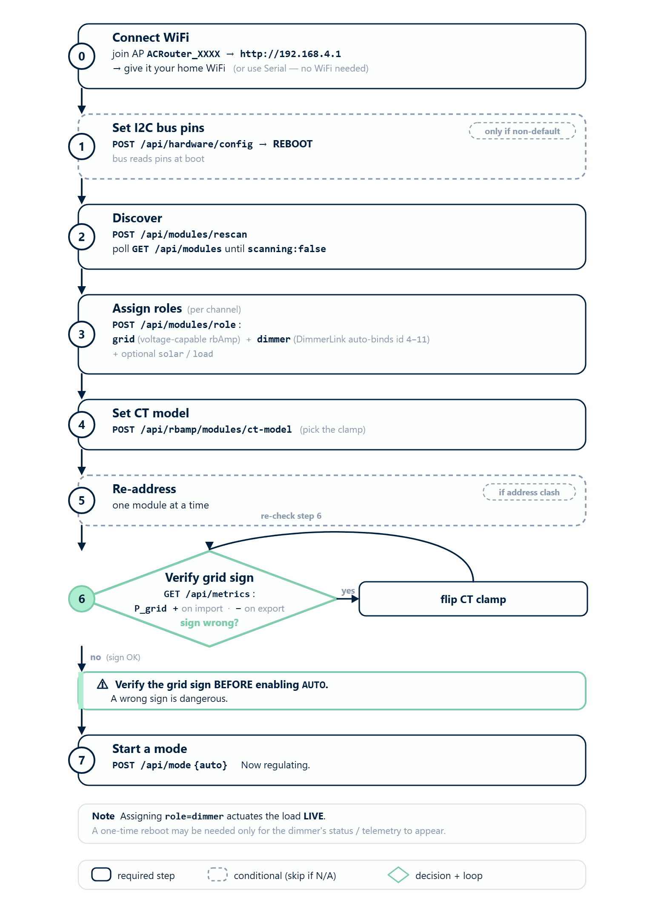
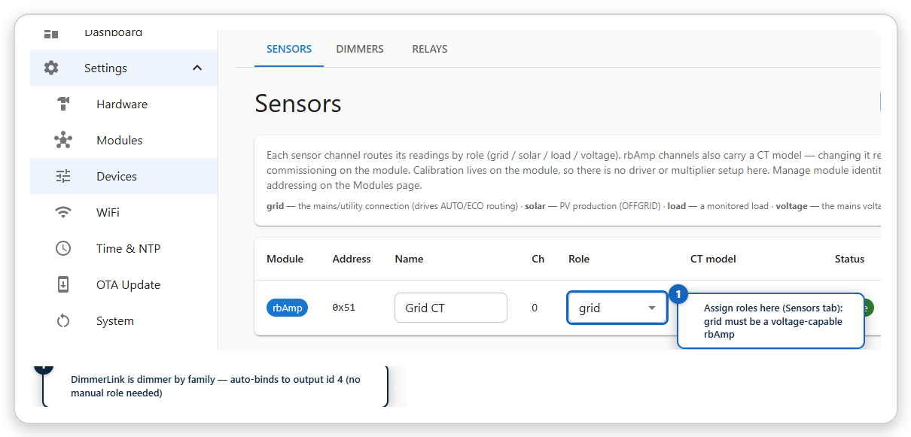
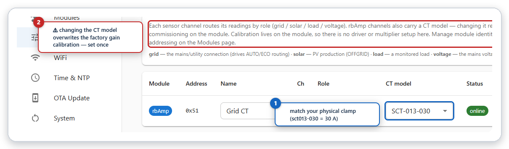
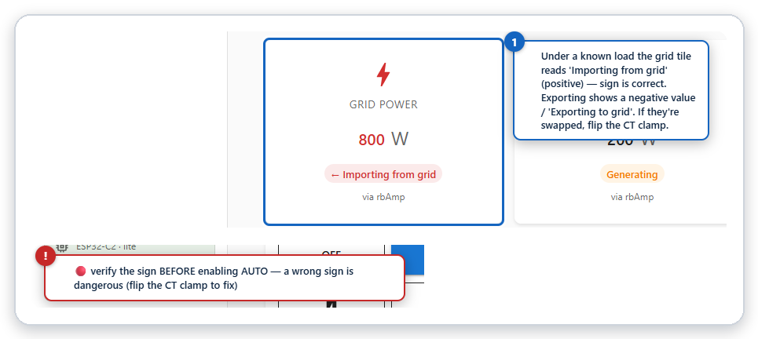

[← Compilation](https://www.rbdimmer.com/acrouter-application-compilation) | [Contents](https://www.rbdimmer.com/acrouter-what-is) | [Next: Operating Modes →](https://www.rbdimmer.com/acrouter-operating-modes)

# Commissioning

Your modules are wired ([Hardware Guide](https://www.rbdimmer.com/acrouter-hardware-guide)) and the
firmware is flashed ([Compilation](https://www.rbdimmer.com/acrouter-application-compilation)). This
guide **binds the modules to roles and starts regulation**.

A v2.0 system is a host MCU plus external smart modules — **rbAmp** (sensing) and **DimmerLink**
(dimmers) — on the I2C bus. The UI is external (the device serves `GET / → 302`), so you drive
commissioning either through the external web app pointed at the device's IP, or with the REST API
directly.

> **Profile note.** The REST commissioning flow below is available on the **ESP32** and **C2-HTTP**
> builds. **C2-MQTT is headless** — it has no REST API; commission it over MQTT (MQTT-bootstrap, see
> the [MQTT Guide](https://www.rbdimmer.com/acrouter-mqtt-guide)).




*The bring-up path: WiFi → discover → assign roles → CT model → verify grid sign → start AUTO.*

### Connect to WiFi first

Steps 1–7 are done through the web app or REST, so get the device onto your network first:

1. On first boot the device starts its own WiFi access point — SSID **`ACRouter_XXXX`**. Join it from a
   phone/laptop and open **`http://192.168.4.1`**.
2. Give it your home WiFi (in the web app, or `POST /api/wifi/connect {"ssid":"…","password":"…"}`,
   or the serial `wifi-connect <ssid> <password>` command). It saves the credentials and joins your LAN.
3. Find its new IP with `GET /api/wifi/status` (or the `wifi-status` serial command), and use that IP for
   the rest of the steps.

> **No WiFi? Use serial instead.** Every step below has a serial-console equivalent (115200 8N1) — you
> can commission the device entirely over USB without WiFi (see
> [Terminal Commands](https://www.rbdimmer.com/acrouter-terminal-commands)). Step 0 (I2C bus pins) is
> always available over serial.

## Key Principles

- **Roles are per-channel, not per-module.** A module is a device (an address); a role is attached to
  an `(address, channel)` pair. The registry (`GET /api/modules`) is the source of truth.
- **The `grid` role must be on a module that also measures voltage.** Only a channel with a voltage
  reference produces **signed** power (import vs. export). A current-only (CT-only) channel cannot tell
  direction. You can tell which modules are voltage-capable from **`has_voltage: true`** in
  `GET /api/rbamp/modules` (this flag is **not** in `GET /api/modules`). **Minimum viable config = one voltage-capable
  rbAmp as `grid` + one DimmerLink** (without a dimmer there is nothing to regulate).
- **`role = dimmer` auto-binds** a DimmerLink to the **first free dimmer output** (id **4** for the first
  DimmerLink, **5** for the second, …) — and it's usually auto-assigned at discovery. You work with roles
  and addresses, never raw output ids.
- **The `voltage` role is optional and distinct from `has_voltage`.** `has_voltage` is a module's
  hardware ability to measure voltage; the `voltage` **role** designates a module as the shared
  voltage/frequency reference for the merge. You only assign a separate `voltage` module when you want
  the reference to come from a dedicated module — a single voltage-capable rbAmp as `grid` already
  provides it.

---

## Step 0 — I2C Bus (only if not on default pins)

Default pins per target: **ESP32** SDA 21 / SCL 22, **ESP32-C2** SDA 5 / SCL 6. To change them:

```
POST /api/hardware/config
{"i2c":{"bus0":{"sda":N,"scl":M}}}
```
This is saved to NVS and **requires a reboot** — the bus reads its pins at boot. After the reboot the
bus can see the modules.

## Step 1 — Discover (rescan)


*After a rescan, the Modules page lists the discovered rbAmp and DimmerLink with their addresses and roles.*

```
POST /api/modules/rescan        → 202 {"scanning":true}
```
The ~2.5 s scan runs in the background (a second rescan while busy → `409 {"error":"busy"}`). Poll
`GET /api/modules` until `"scanning": false` — the list is then fresh. Each module reports its
`family` (a current DimmerLink shows as **`DimmerLink(legacy)`**; rbAmp shows as `rbAmp`), `addr`,
channels, current `roles[]`, and `valid_roles[]` (the only roles allowed for that family — a UI offers
exactly these).

## Step 2 — Assign Roles (per channel)




*Roles are assigned per channel on the Sensors tab — start with grid on a voltage-capable rbAmp.*

```
POST /api/modules/role
{ "addr": "0x51", "channel": 0, "role": "grid" }
```
- `role` ∈ `grid | solar | load | voltage | dimmer | relay | none`
- → `200 {"success":true,"message":"Role saved"}` · no module → `404` · bad channel → `400`
- This is the **recommended** way to bind a module — the registry is the source of truth, and
  `role = dimmer` auto-binds the DimmerLink to dimmer id 4.

Start with the mandatory **`grid`** channel (on a voltage-capable rbAmp), then add `solar` / `load` as
wired, and `dimmer` for the DimmerLink.

> 🔁 **Assigning `role=dimmer` binds and drives the output live** — no reboot is needed for the dimmer to
> actuate the load. A one-time **reboot may be needed for the dimmer's status/telemetry to populate**
> (the status poll task is created at boot when ≥1 dimmer is enabled). Subsequent dimmers and level
> changes apply live.

## Step 3 — Set the CT Model (per rbAmp channel)




*Select the CT model matching your clamp — this overwrites the factory gain, so set it once.*

Fetch the catalog with `GET /api/rbamp/ct-models`, then set the model that matches your physical CT:

```
POST /api/rbamp/modules/ct-model
{ "addr": "0x51", "ct_model": "sct013-030" }        → 202 {"pending":true, …}
```
- `ct_model` is a catalog `id` (e.g. `sct013-030` = a 30 A clamp).
- ⚠️ **Changing the CT model overwrites the module's per-unit factory gain calibration** with the
  model's preset gain. Set it once for the correct clamp; re-selecting the same model is a no-op.

## Step 4 — Resolve Address Conflicts (re-address)

If two modules share the same default address, give each a unique one:

```
POST /api/rbamp/modules/address
{ "addr": "0x51", "new_addr": "0x52" }              → 202 {"pending":true, …}
```
Two-phase commit; the new address **applies after the module resets**. Run a rescan afterwards — the
module re-appears at the new address and its role mapping migrates automatically.

> 🔴 **Address two same-address modules one at a time.** Two modules at the same factory address both
> answer on it, so you can't target one to re-address it. Connect them to the bus **one at a time** for
> the initial re-addressing, then bring the rest online.

## Step 5 — Name the Channels (optional)

`POST /api/modules/name` sets a human-readable per-channel name that shows up in `GET /api/modules`
(`names[]`) and the UI.

## Step 6 — Verify Sensing




*Confirm the grid direction under a known load — it must read 'Importing from grid' — before you enable AUTO.*

Read `GET /api/sensors` (per-source live V/I/P/PF/frequency + role) or `GET /api/metrics` (merged
`power_grid` / `power_solar` / `power_load`).

> 🔴 **Check the grid sign under a known load.** `power_grid` must read **+** when importing and **−**
> when exporting. If the sign or direction is wrong, the grid channel isn't voltage-capable, or the CT
> model / clamp polarity is off.

## Step 7 — Start a Mode

```
POST /api/mode
{ "mode": "auto" }
```
Modes: `off · auto · eco · offgrid · manual · boost · grid_limit`. For **grid_limit**, set the current
cap: `POST /api/config {"grid_current_limit": <A>}` (default 16.0 A). See
[Router Modes](https://www.rbdimmer.com/acrouter-operating-modes) for what each mode does.

Your system is now regulating — in AUTO it will raise the dimmer whenever you'd otherwise export, so
the surplus heats your load instead of feeding the grid.

---

## Troubleshooting

| Symptom | Check |
|---------|-------|
| **`i2c-scan` / rescan finds nothing** | Module power (3V3) and common ground; the two **4.7 kΩ pull-ups** on SDA/SCL; correct bus pins for your target ([Hardware Guide §1.2](https://www.rbdimmer.com/acrouter-hardware-guide)); on a C2, that you didn't reuse a strapping/flash pin. |
| **Dimmer assigned but the load doesn't move** | Did you **reboot once** after enabling the first DimmerLink? (Step 2 note.) Is the mode AUTO/BOOST/MANUAL and is there surplus to divert? |
| **`power_grid` sign is inverted** (+/− swapped) | Flip the **grid CT clamp** around the conductor (the clamp has an arrow for current direction). A wrong sign is dangerous in AUTO — fix it before enabling AUTO. |
| **`power_grid` reads 0 / unstable** | The grid module must be **voltage-capable** (`has_voltage:true` in `/api/rbamp/modules`); the CT must clamp a **single** conductor (L *and* N together read ≈0). |
| **Serial console / COM port not visible** | Install the USB-UART driver for your board (CP210x or CH340); on Linux add your user to the `dialout` group. |
| **Two modules won't address** | They share a factory address and both answer — connect them **one at a time** to re-address (Step 4). |

---

## Not in v2.0

If you followed a v1.x commissioning guide, these steps are gone (sensing moved to smart modules):

- **ADC channel setup** (`adc_channels`) — ignored; sensing is external.
- **Sensor-driver selection** — `/api/hardware/sensor-profiles`, `/sensor-types`, `/voltage-drivers`,
  `/current-drivers` are **removed** (smart modules are factory-calibrated).
- **Per-GPIO dimmer config** (`/api/dimmers/{0-3}/…`) — removed; the dimmer is driven by the router
  mode, not per channel.

> **ESP-NOW nodes (ESP32 only).** On an ESP32 build, wireless measurement nodes appear with
> `source: espnow`, are keyed by MAC, and their dimmer outputs start at id 12+. Assign their roles with
> **`POST /api/espnow/nodes {"mac":…,"role":…}`** (or serial `espnow-config`) — `/api/modules/role` takes
> an I2C address, not a MAC. ESP-NOW is an **ESP32-tier** feature; the ESP32-C2 uses wired DimmerLink over I2C.

---

[← Compilation](https://www.rbdimmer.com/acrouter-application-compilation) | [Contents](https://www.rbdimmer.com/acrouter-what-is) | [Next: Operating Modes →](https://www.rbdimmer.com/acrouter-operating-modes)
