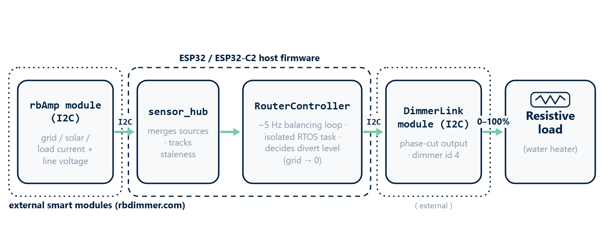
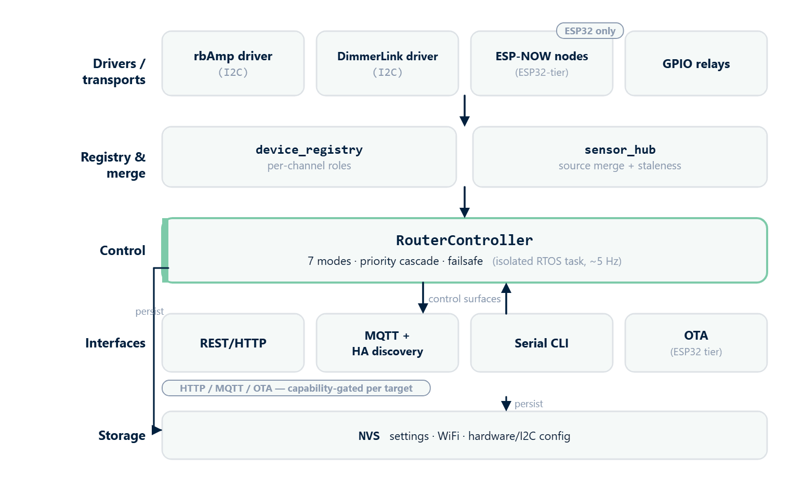
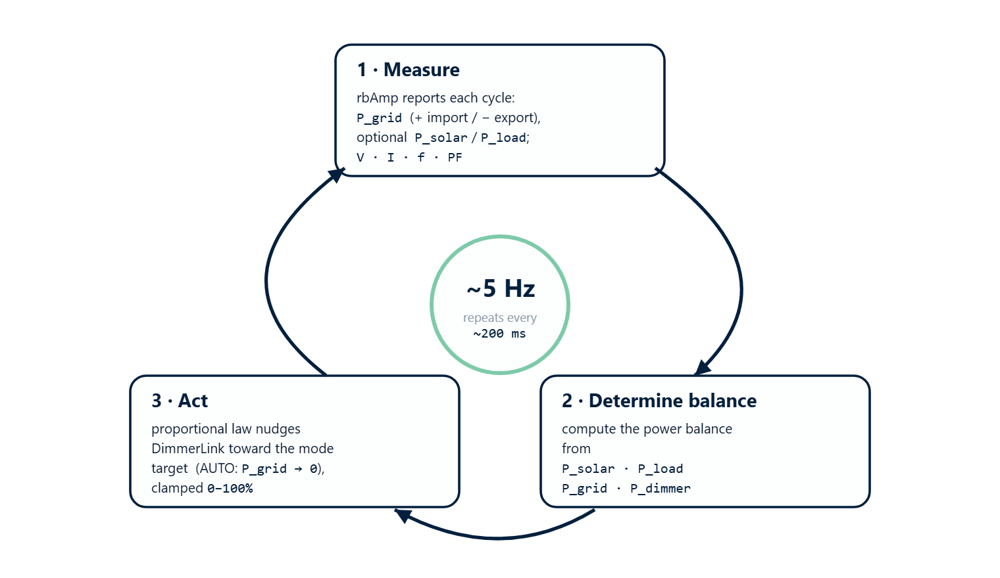

[← ChangeLog](https://www.rbdimmer.com/acrouter-changelog) | [Contents](https://www.rbdimmer.com/acrouter-what-is) | [Next: Hardware Guide →](https://www.rbdimmer.com/acrouter-hardware-guide)

# Application Overview

> **ACRouter v2.0.** Sensing and dimming are handled by smart **I2C modules** — **rbAmp**
> (current/voltage measurement) and **DimmerLink** (phase-cut dimmer). The on-chip ADC sensing and
> direct GPIO/TRIAC dimming of v1.x have been removed. See the
> [Hardware Guide](https://www.rbdimmer.com/acrouter-hardware-guide) for wiring.

## 1.1 Purpose

**ACRouter** is an open-source controller that automatically redirects **excess solar energy** to
resistive loads (such as water heaters) via **phase-angle dimming**, instead of exporting it to the
grid. It can also cap grid consumption during expensive tariff periods.

**Main goal:** keep the grid exchange near zero — dynamically controlling load power from the live
balance between production and consumption — to maximize solar self-consumption and cut electricity costs.

### Key Benefits
- ✅ Automatic management of excess solar energy
- ✅ Higher self-consumption, lower electricity bills — no batteries required
- ✅ Import protection (ECO) and grid-import capping (GRID_LIMIT)
- ✅ Smart plug-and-measure modules (rbAmp / DimmerLink) — factory-calibrated, no ADC tuning
- ✅ Runs on ESP32 and low-cost ESP32-C2
- ✅ External web app, REST API, MQTT + Home Assistant, OTA
- ✅ Fully open source

---

## 1.2 System Architecture (v2.0)

An ACRouter system is an **ESP32-family host** plus one or more **smart I2C modules**:

| Part | Role |
|------|------|
| **Host** — ESP32 or ESP32-C2 | Runs the firmware, control loop, connectivity |
| **rbAmp** | Measures grid / solar / load current (clamp-on CT) and line voltage, over I2C |
| **DimmerLink** | Phase-cut dimmer that drives the resistive load, over I2C |

### Control-loop pipeline (~5 Hz)

*rbAmp measures, the host decides the divert level, DimmerLink drives the load — grid exchange trends to zero.*

1. **rbAmp** measures grid power (plus optional solar/load) and reports over I2C.
2. **`sensor_hub`** merges the sources and tracks staleness.
3. **`RouterController`** runs the balancing loop (isolated in its own RTOS task) and decides how much
   surplus to divert.
4. It drives the **DimmerLink** output (dimmer **id 4**), adjusting the level so grid exchange trends
   to zero.

> The control loop and metrics run at roughly **5 Hz**. Measurement now happens *inside* the rbAmp
> module and arrives over I2C — there is no on-device ADC path.

*Firmware is modular: swappable I2C/wireless drivers feed a unified registry and sensor hub; one RouterController task runs the modes; interfaces and storage are capability-gated per target.*

---

## 1.3 Features

### Measurement & Monitoring
- **Current & voltage sensing via rbAmp** (clamp-on CTs): grid (import/export sign), plus optional
  solar and load channels, and line voltage.
- **Factory-calibrated smart modules** — no ADC gain/offset tuning; select the CT model from a catalog.
- **Active power, power factor, frequency** computed from the module data.
- **~5 Hz** system update rate.

### Load Control
- **Phase-angle dimming via DimmerLink** (0–100%, smooth) on its own dedicated controller.
- Zero-cross synchronization is handled **inside** the DimmerLink module.
- I2C dimmer outputs start at **id 4** (legacy on-chip dimmer ids 0–3 are retired).
- **Relay outputs** for on/off loads.

### Connectivity

*The dashboard: live grid/solar/load power, the divert level, and the mode selector — here exporting 1200 W into the load in AUTO.*
- **External web application** — capability-aware UI; the device **redirects** to it (it does not host
  the SPA).
- **REST API** — full JSON control/monitoring surface
  ([GET](https://www.rbdimmer.com/acrouter-web-api-get) / [POST](https://www.rbdimmer.com/acrouter-web-api-post)).
- **MQTT + Home Assistant** auto-discovery, including config-over-MQTT for headless setups.
- **OTA** firmware updates (ESP32 tier).
- **WiFi** AP (192.168.4.1) for setup + STA for normal operation.
- **Serial console** (115200 baud) for configuration and diagnostics.

### Configuration & Storage
- Settings, WiFi credentials, and hardware/I2C configuration persist in **NVS**.
- Configure through the external web app, the REST API, MQTT, or the serial console.

---

## 1.4 How the Control Loop Works

*Every ~200 ms the controller measures, computes the power balance, and nudges the dimmer toward the active mode's target.*

Each control cycle (~5 Hz):

1. **Measure** — rbAmp reports grid power `P_grid` (+ importing, − exporting) and, if wired, solar and
   load; the host also has line voltage, current, frequency and power factor.
2. **Determine balance** — `P_solar` (generation), `P_load` (house consumption), `P_grid` (grid
   exchange), `P_dimmer` (diverted load).
3. **Act** — a proportional control law nudges the DimmerLink level toward the mode's target (e.g. for
   AUTO, `P_grid → 0`), constrained to 0–100%.

**Multiple loads.** More than one dimmer (and GPIO relays) can be driven in a **priority cascade** — when
a higher-priority dimmer saturates, the surplus spills to the next device; in AUTO, relays switch on for
large surpluses. I2C dimmers are ids 4–11, ESP-NOW dimmer nodes 12+ (ESP-NOW is ESP32-tier).

---

## 1.5 Operating Modes

ACRouter supports **seven** operating modes (`/api/mode`, or the web app / serial console). For the
full behavior of each, see [Router Modes](https://www.rbdimmer.com/acrouter-operating-modes).

### OFF — Disabled
Dimmer forced to 0%; the system does not regulate. Measurement, web app, and serial keep working.
Use for maintenance or to disconnect the load.

### AUTO — Automatic Solar Router *(primary)*
Balances `P_grid → 0`. When exporting, it raises the dimmer (heats the load); when importing, it
lowers it. All surplus solar is consumed locally.

### ECO — Anti-Import
Avoids drawing from the grid, but allows export. When the site is **importing**, ECO lowers the dimmer
to stop buying from the grid; when exporting or balanced, it **holds** and does not chase the surplus
(that surplus is exported). Unlike AUTO — which drives `P_grid → 0` in *both* directions and consumes
all surplus locally — ECO only trims on import and leaves export untouched. Use it when export is
acceptable (you have a feed-in tariff) but you don't want to pay for grid import under the diverted load.

### OFFGRID — Autonomous
For systems with no grid connection. **Requires a `solar` rbAmp channel.** It runs the load from the
measured solar generation and backs off as solar falls. ⚠️ It tracks **solar only** — it does **not**
sense battery state of charge, so under heavy house load it can still draw from the battery. Use on
off-grid solar systems, sizing the load accordingly. (See [Router Modes](https://www.rbdimmer.com/acrouter-operating-modes)
for the exact behavior.)

### MANUAL — Fixed Level
The dimmer holds a user-set level (0–100%) with no automation. Use for testing or a fixed schedule.

### BOOST — Maximum Power
Dimmer forced to 100% regardless of sensors. Use for fast heating on a cheap tariff.
⚠️ High grid consumption — watch load temperature.

### GRID_LIMIT — Grid-Consumption Cap
Caps how much the site draws from the grid, by **current** (current-based, no export). Set the limit
with `/api/config` (`grid_current_limit`). Use to stay under a supply/breaker limit.

---

## 1.6 Mode Comparison

| Mode | Dimmer Control | Grid Target | Import | Export | Use Case |
|------|----------------|-------------|--------|--------|----------|
| **OFF** | 0% (fixed) | — | N/A | N/A | Maintenance |
| **AUTO** | Automatic | `P_grid → 0` | ✅ | ✅ | Standard solar routing |
| **ECO** | Auto (anti-import) | `P_grid ≤ 0` (no import) | ❌ (avoided) | ✅ | Export OK, avoid paid import |
| **OFFGRID** | Auto (solar only) | — | N/A | N/A | Off-grid systems |
| **MANUAL** | Fixed (user) | — | ✅ | ✅ | Testing / scheduling |
| **BOOST** | 100% (fixed) | — | ✅ | ❌ | Fast heating |
| **GRID_LIMIT** | Auto (import cap) | current cap | ✅ (capped) | ❌ | Stay under supply limit |

---

## 1.7 Use Case Scenarios

**Standard solar router (AUTO).** 3 kW PV + a 2 kW water heater. Daytime surplus would export; AUTO
raises the dimmer until `P_grid ≈ 0`, so all surplus heats water.

**Import avoidance (ECO).** A site that may export freely (feed-in tariff) but wants to avoid paying
for grid import under the diverted load. ECO trims the dimmer whenever the site starts importing, and
leaves any solar surplus to export. *(To consume all surplus locally instead, use AUTO.)*

**Off-grid (OFFGRID).** PV + batteries, no grid. The heater runs from measured solar generation and
backs off as solar falls. Size the load to your system — the mode tracks solar, not battery charge.

**Grid-limit (GRID_LIMIT).** A site on a limited supply. The router caps total grid draw by current so
combined loads never trip the supply limit.

### Product Kits

ACRouter ships as three kits. Each adds the sensing needed for more capable modes; every kit includes a
power-rated DimmerLink dimmer with **temperature control** (load-side thermal protection).

| Kit | Adds | What it does | Modes unlocked |
|-----|------|--------------|----------------|
| **[K0 Schedule](https://www.rbdimmer.com/shop/k0-schedule-84)** | — (dimmer + DimmerLink only) | Scheduled or manual heating with **no consumption monitoring** — e.g. run during low-tariff windows | MANUAL, BOOST |
| **[K1 Grid Limit](https://www.rbdimmer.com/shop/k1-grid-limit-85)** | + 1× rbAmp (`grid`, voltage-capable) | The core ACRouter kit — its voltage-capable grid module senses **direction** (import vs. export), so it avoids paid import, balances `P_grid → 0`, and caps grid draw | + GRID_LIMIT, ECO, AUTO |
| **[K2 Grid-Solar Balance](https://www.rbdimmer.com/shop/k2-grid-solar-balance-86)** | + 2× rbAmp (`grid` + `solar`) | Everything K1 does, plus a `solar` channel for **off-grid** operation — routing from measured generation, including while charging batteries | + OFFGRID |

Adding rbAmp channels is what unlocks the **closed-loop** modes: the **voltage-capable `grid`** channel
enables AUTO / ECO / GRID_LIMIT (it must tell import from export), and a `solar` channel adds OFFGRID.
Start with **K1** for standard self-consumption / anti-import; choose **K2** when you also generate solar
(or run off-grid); **K0** is the entry kit for simple scheduled heating without measurement.

> **How K0 "schedules."** v2.0 has **no built-in time scheduler yet** — a K0 reaches "run at low tariff"
> by letting an external controller (Home Assistant, an MQTT automation, or any REST client) set
> MANUAL/BOOST on a timer. A **built-in scheduler is planned for a release shortly after 2.0**; see the
> [Roadmap](https://www.rbdimmer.com/acrouter-roadmap).

---

## 1.8 Two Build Targets

v2.0 runs on two chips, validated on both:

| Target | Interfaces | Notes |
|--------|-----------|-------|
| **ESP32** (WROOM/WROVER) | HTTP/REST, MQTT, OTA, TLS | Dual-core; both interfaces + ESP-NOW |
| **ESP32-C2 / ESP8684** | one interface per build | RAM-constrained; one of two C2 profiles |

There are **three compile profiles** in total — **ESP32 (full)**, **C2-HTTP** (REST), and **C2-MQTT**
(headless, MQTT-only). The C2 uses one of its **two** (HTTP *or* MQTT); the ESP32 build carries both.
The UI is **capability-aware**: it discovers what a build supports at runtime (`/api/info` →
`features`) and gates sections accordingly — never by the chip name.

For the full **feature-by-profile comparison** (HTTP, MQTT, Home Assistant, OTA, TLS, ESP-NOW, RAM,
setup path), see the capability matrix in
[Compilation §2.2](https://www.rbdimmer.com/acrouter-application-compilation). In short: the **ESP32**
build does everything; **C2-HTTP** gives the web/REST UI but no MQTT/OTA; **C2-MQTT** is headless
(MQTT only, no web UI).

---

## 1.9 Target Audience

DIY enthusiasts building a solar router; homeowners optimizing self-consumption; developers using
ACRouter as an open-source foundation; educational IoT/energy projects; and small businesses cutting
electricity costs.

---

## 1.10 Limitations & Safety

> ⚠️ **Mains voltage (110 V / 230 V) is dangerous.** The rbAmp and DimmerLink modules sit on the mains
> side — treat the whole build as a live-mains project. See the
> [Hardware Guide → Safety](https://www.rbdimmer.com/acrouter-hardware-guide) for full requirements.

- **Qualified work only** — de-energize before wiring; use RCD/GFCI protection and proper enclosures.
- **Resistive loads only** — heating elements. **Not** for inductive loads (motors, transformers) or
  electronics (LED drivers, power supplies).
- **Power** — the maximum is set by your DimmerLink/load rating; provide cooling for high loads.
- **Grid** — a stable 50/60 Hz supply is assumed.
- 🔴 **CT polarity is safety-critical.** If the grid CT is reversed, `power_grid`'s sign flips and AUTO
  runs the wrong way — driving the dimmer to 100% while importing (maximum grid draw, breaker-trip
  risk). Verify the grid sign under a known load **before** enabling AUTO (see
  [Commissioning](https://www.rbdimmer.com/acrouter-commissioning)).
- 🔴 **Sensor-loss failsafe.** If the regulating sensor is lost (or all sources fall silent), the
  controller **decays the dimmer toward 0%** (~1%/cycle, ~20 s) rather than holding the last level —
  AUTO/ECO/GRID_LIMIT and OFFGRID all fail toward off. Still provide an **external emergency disconnect**
  (a contactor) as defense-in-depth.

---

[← ChangeLog](https://www.rbdimmer.com/acrouter-changelog) | [Contents](https://www.rbdimmer.com/acrouter-what-is) | [Next: Hardware Guide →](https://www.rbdimmer.com/acrouter-hardware-guide)
