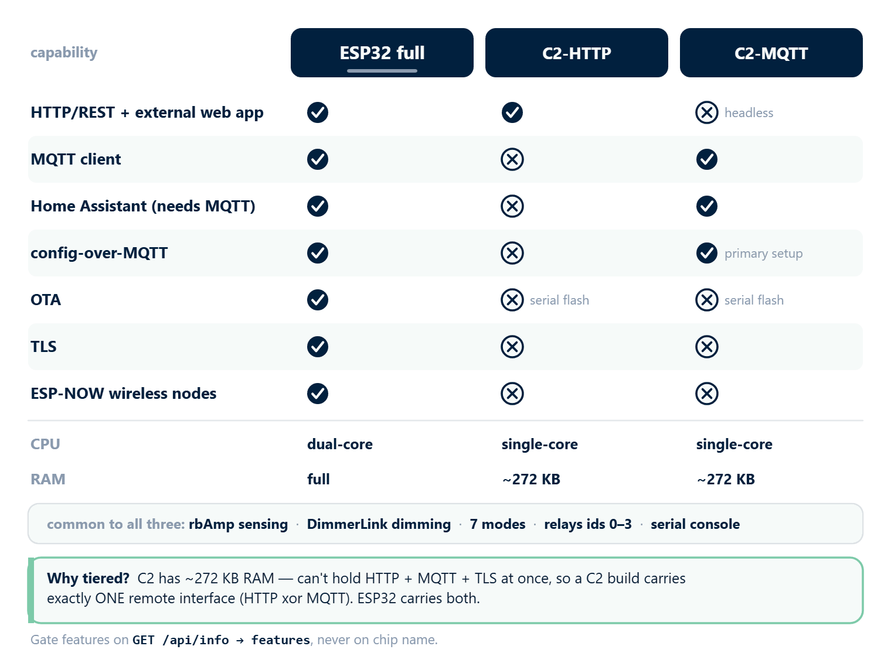

[← Hardware Guide](https://www.rbdimmer.com/acrouter-hardware-guide) | [Contents](https://www.rbdimmer.com/acrouter-what-is) | [Next: Commissioning →](https://www.rbdimmer.com/acrouter-commissioning)

# Compilation

ACRouter v2.0 builds with **ESP-IDF 5.5** using `idf.py`. It runs on **two targets** and ships in one
of **three compile profiles** — pick the one that matches your chip and how you want to control the
device.

---

## 2.1 Toolchain

- **ESP-IDF 5.5** (5.5.1) — the firmware is built with **ESP-IDF (`idf.py`)**, not the Arduino IDE or
  PlatformIO.
- **Python 3.9+** and **CMake 3.16+** (bundled with the ESP-IDF installer; ESP-IDF 5.5 requires Python 3.9+).
- **Managed components** are resolved automatically by the IDF Component Manager from
  `main/idf_component.yml` on the first `set-target` / `reconfigure` — notably **Arduino Core 3.x**
  (`espressif/arduino-esp32`) and **ArduinoJson v7** (`bblanchon/arduinojson`). ACRouter uses the
  Arduino API (`String`, `millis()`, …) on top of the ESP-IDF build system.

### Install ESP-IDF

```bash
mkdir -p ~/esp && cd ~/esp
git clone -b v5.5.1 --recursive https://github.com/espressif/esp-idf.git
cd esp-idf
./install.sh esp32,esp32c2      # install both target toolchains
. ~/esp/esp-idf/export.sh       # activate the environment (each shell)
```

Then clone the firmware and enter it:

```bash
git clone https://github.com/robotdyn-dimmer/ACRouter.git
cd ACRouter
```

On Windows, use the ESP-IDF environment — run `export.ps1` in PowerShell, or `export.bat` in CMD.

---

## 2.2 Two Targets, Three Profiles

| Target | Chip | Cores | Default profile |
|--------|------|-------|-----------------|
| **esp32** | ESP32 (WROOM/WROVER) | dual-core | ESP32 full |
| **esp32c2** | ESP32-C2 / ESP8684 | single-core, RAM-limited | one interface per build |

Each build carries exactly one **compile profile**. This is what differs between the three:

| Capability | ESP32 full | C2-HTTP | C2-MQTT |
|------------|:----------:|:-------:|:-------:|
| **HTTP/REST API + external web app** | ✅ | ✅ | ❌ *(headless)* |
| **MQTT client** | ✅ | ❌ | ✅ |
| **Home Assistant** (needs MQTT) | ✅ | ❌ | ✅ |
| **config-over-MQTT** | ✅ | ❌ | ✅ *(primary setup path)* |
| **OTA** (over-the-air update) | ✅ | ❌ *(serial flash)* | ❌ *(serial flash)* |
| **TLS** | ✅ | ❌ | ❌ |
| **ESP-NOW** wireless nodes | ✅ | ❌ | ❌ |
| CPU | dual-core | single-core | single-core |
| RAM | full | ~272 KB | ~272 KB |
| First-time setup | web app or serial | web app or serial | **serial bootstrap** (WiFi + broker) |




*One firmware, three profiles: the ESP32 carries every interface; each ESP32-C2 build carries exactly one remote interface to fit its RAM.*

> **ESP-NOW wireless sensor/output nodes are an ESP32-tier feature.** The ESP32-C2 profiles use **wired
> DimmerLink over I2C only** — no wireless nodes.

**Same on every build:** rbAmp sensing, DimmerLink dimming, the seven [operating modes](https://www.rbdimmer.com/acrouter-operating-modes),
relays (ids 0–3), and the serial console. The external web app works on any **HTTP-capable** build (ESP32
full, C2-HTTP); gate features on `GET /api/info` → `features`, never on the chip name (§2.5).

> 🔴 **Why the tiering?** The ESP32-C2 has ~272 KB RAM — not enough to hold HTTP + MQTT + TLS at once.
> So a C2 build carries **exactly one** remote interface (**HTTP xor MQTT**), chosen at compile time.
> The ESP32 has the headroom to carry both. On **C2-MQTT there is no HTTP server at all** — the device
> is reached only through the broker.

---

## 2.3 Profile Flags (Kconfig)

A profile is a set of Kconfig options, resolved from an `sdkconfig.defaults` layer:

| Option | Meaning |
|--------|---------|
| `CONFIG_ACROUTER_HTTP_SERVER` | HTTP/REST server |
| `CONFIG_ACROUTER_MQTT_CLIENT` | MQTT client |
| `CONFIG_ACROUTER_OTA` | OTA update subsystem |
| `CONFIG_ACROUTER_RBAMP_SOURCE` | rbAmp I2C sensing source |
| `CONFIG_ACROUTER_MQTT_BOOTSTRAP` | config-over-MQTT provisioning (C2-MQTT) |

The default C2 profile is **C2-HTTP** — HTTP on, MQTT and OTA off. The exact per-target Kconfig
defaults live in the repo's `sdkconfig` / `sdkconfig.defaults*` files; treat those as the source of
truth (the C2-MQTT profile flips HTTP off and MQTT on via its own defaults layer, below).

> 🔴 **Gotcha — keep profile flags in an `sdkconfig.defaults` layer, not in a hand-edited `sdkconfig`.**
> `idf.py set-target` **regenerates** `sdkconfig` from the defaults and discards manual edits. That is
> exactly why the headless profile ships as a separate `sdkconfig.defaults.c2mqtt` layer.

---

## 2.4 Build & Flash

Use a **separate build directory per target** so the ESP32 and C2 builds don't clobber each other.
`<PORT>` is `COM3` (Windows) or `/dev/ttyUSB0` (Linux).

### ESP32 full
```bash
idf.py set-target esp32
idf.py build
idf.py -p <PORT> flash
```

### C2-HTTP
```bash
idf.py -B build_c2 -D SDKCONFIG=sdkconfig.c2 set-target esp32c2
idf.py -B build_c2 -D SDKCONFIG=sdkconfig.c2 build
idf.py -B build_c2 -D SDKCONFIG=sdkconfig.c2 -p <PORT> flash
```

### C2-MQTT (headless)
```bash
idf.py -B build_c2mqtt -D SDKCONFIG=sdkconfig.c2mqtt \
  -D SDKCONFIG_DEFAULTS="sdkconfig.defaults;sdkconfig.defaults.c2mqtt" \
  set-target esp32c2
idf.py -B build_c2mqtt -D SDKCONFIG=sdkconfig.c2mqtt -D SDKCONFIG_DEFAULTS="sdkconfig.defaults;sdkconfig.defaults.c2mqtt" build
idf.py -B build_c2mqtt -D SDKCONFIG=sdkconfig.c2mqtt -D SDKCONFIG_DEFAULTS="sdkconfig.defaults;sdkconfig.defaults.c2mqtt" -p <PORT> flash
```

> The separate `-D SDKCONFIG=<file>` per C2 profile keeps each build's `sdkconfig` out of the root file,
> so `set-target` for one target can't clobber another's config (see the §2.3 gotcha).

> Large OTA-over-WiFi is impractical on the C2 — flash the C2 over **serial**.

### Monitor
```bash
idf.py -p <PORT> monitor     # picks the correct baud automatically; Ctrl-] to exit
```

### Partitions & OTA
The flash layout is **dual-OTA** — two app slots (`app0`, `app1`) so firmware can update over the air,
plus `nvs` (configuration) and `otadata` (which slot is active). There is **no SPIFFS/web-UI
partition** — the UI is external in v2.0. Exact slot sizes vary by target; the layout is defined in the
repo's `partitions.csv`.

---

## 2.5 Capability-Aware Runtime

A build advertises what it carries at runtime — `GET /api/info` returns a `features` object
(`http`, `mqtt`, `ota`, `github_ota`, `tls`). The same web app works against every **HTTP-capable**
profile (ESP32 full, C2-HTTP) and shows only what the build supports — the headless C2-MQTT profile has
no HTTP server, so there is no web UI on it. **Gate features on these flags, never on the chip name.**

```json
{ "chip": "ESP32-C2", "features": { "http": true, "mqtt": false, "ota": false, "github_ota": false, "tls": false } }
```

---

## 2.6 Manual Flashing (esptool)

For normal flashing use `idf.py -p <PORT> flash` — it already knows the right offsets. To flash without
`idf.py` (e.g. from another machine), match `--chip` to your target (`esp32` or `esp32c2`) and use the
artifacts from the corresponding build directory:

```bash
# ESP32 (classic) — bootloader at 0x1000
esptool.py --chip esp32 --port <PORT> --baud 921600 \
  --before default_reset --after hard_reset write_flash -z \
  0x1000  build/bootloader/bootloader.bin \
  0x8000  build/partition_table/partition-table.bin \
  0xf000  build/ota_data_initial.bin \
  0x20000 build/ACRouter-project.bin
```

> **The bootloader offset is target-specific:** `0x1000` on the classic **ESP32**, `0x0` on the
> **ESP32-C2** (and C3/S3). The app binary is `ACRouter-project.bin` at `0x20000` (custom partition
> table). Rather than copy offsets by hand, take the exact `esptool.py write_flash …` line that
> `idf.py build` prints at the end of a build for your target.

---

## 2.7 Common Build Issues

- **Wrong target / stale sdkconfig.** If a C2 build behaves like an ESP32 build (or vice-versa),
  your `sdkconfig` was regenerated from the wrong defaults — see the [§2.3 gotcha](#23-profile-flags-kconfig).
  Use the right `-B <dir>` + `SDKCONFIG_DEFAULTS` and re-run `set-target`.
- **ESP-IDF version mismatch.** `idf.py --version` must report **v5.5.x**. Re-install 5.5.1 if it differs.
- **Dependency not found.** Run `idf.py reconfigure` to re-resolve managed components.
- **App partition too small.** Ensure your build directory matches the target; a C2 image flashed
  against an ESP32 partition layout (or vice-versa) will not fit.

---

## 2.8 Pre-Built Binaries

> **v2.0 (2.0.0) is released.** Pre-built per-target/profile binaries (ESP32 / C2-HTTP / C2-MQTT) and a
> browser-based flashing tool are being prepared — until they are posted, build from source as above.
> Check the [GitHub Releases](https://github.com/robotdyn-dimmer/ACRouter/releases) page for available
> downloads.

---

[← Hardware Guide](https://www.rbdimmer.com/acrouter-hardware-guide) | [Contents](https://www.rbdimmer.com/acrouter-what-is) | [Next: Commissioning →](https://www.rbdimmer.com/acrouter-commissioning)
