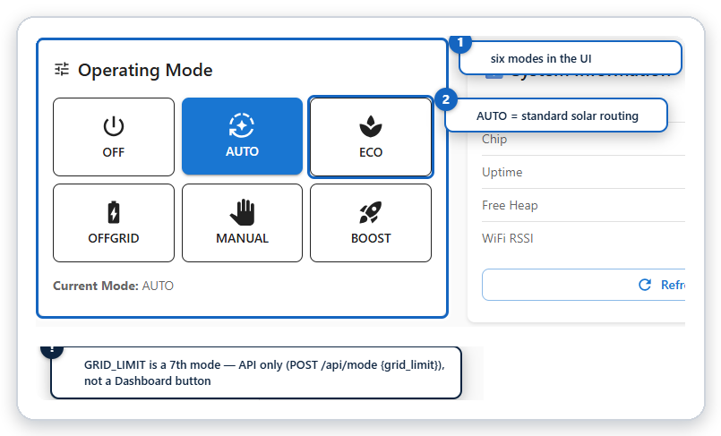
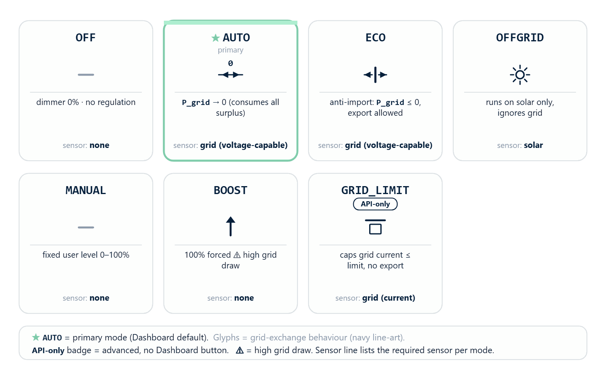
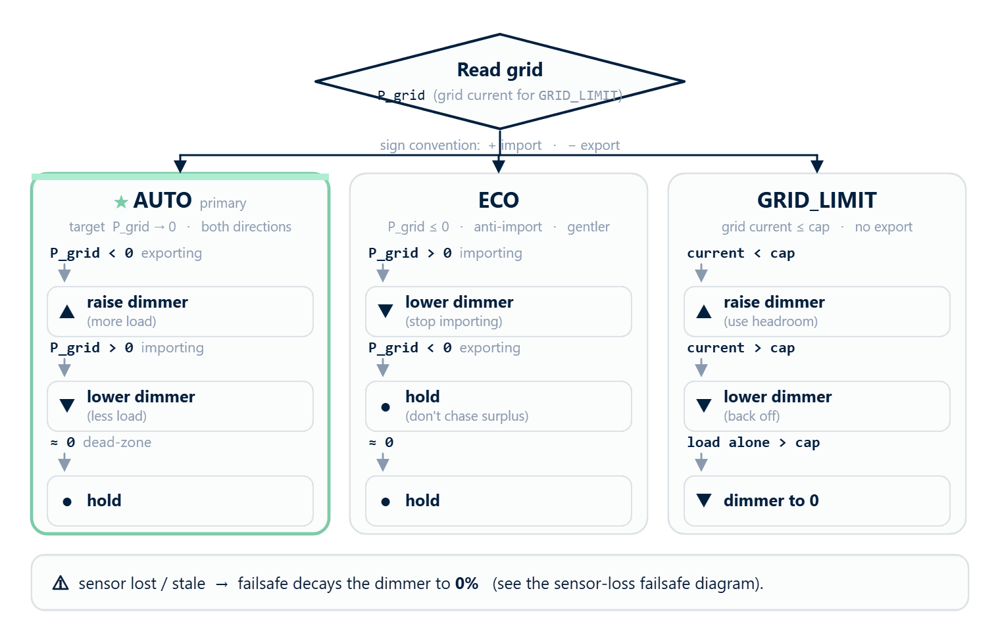
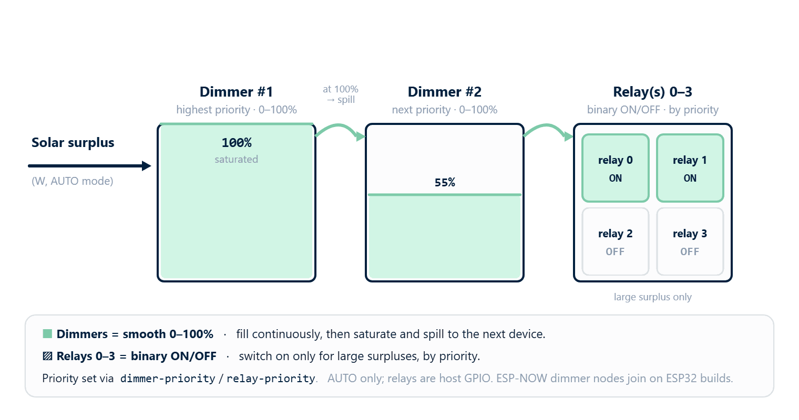
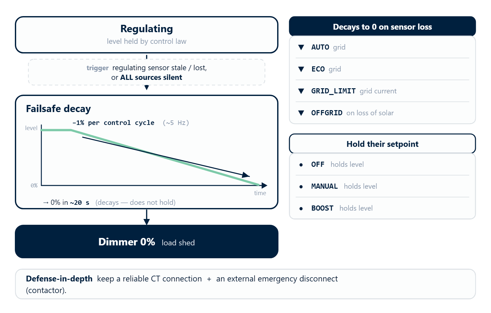
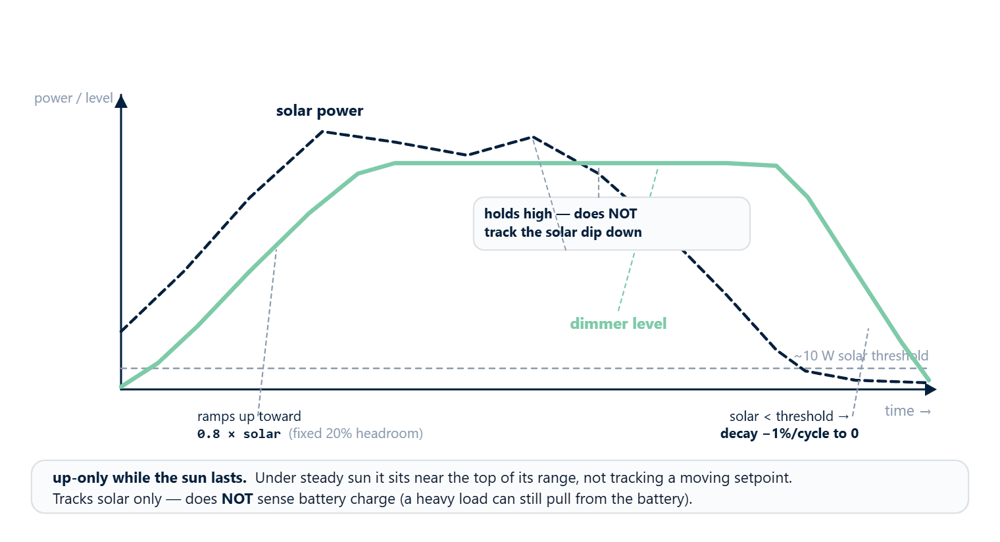

[← Commissioning](https://www.rbdimmer.com/acrouter-commissioning) | [Contents](https://www.rbdimmer.com/acrouter-what-is) | [Next: Terminal Commands →](https://www.rbdimmer.com/acrouter-terminal-commands)

# Operating Modes

ACRouter has **seven** operating modes. Set one with `POST /api/mode {"mode":"<name>"}`, the web app, or
the serial console (see [Terminal Commands](https://www.rbdimmer.com/acrouter-terminal-commands)).

## 4.1 Mode Overview

| Mode | API name | Enum | Dimmer | Grid target | Sensor role needed |
|------|----------|:----:|--------|-------------|--------------------|
| **OFF** | `off` | 0 | 0% (fixed) | — | none |
| **AUTO** ⭐ | `auto` | 1 | automatic | `P_grid → 0` | grid |
| **ECO** | `eco` | 2 | automatic (import-avoid) | `P_grid ≤ 0` (no import) | grid |
| **OFFGRID** | `offgrid` | 3 | automatic (solar) | — | solar |
| **MANUAL** | `manual` | 4 | fixed (user) | — | none |
| **BOOST** | `boost` | 5 | 100% (fixed) | — | none |
| **GRID_LIMIT** | `grid_limit` | 6 | automatic (import cap) | grid current ≤ limit | grid |

The `grid` and `solar` roles are assigned per rbAmp channel during
[Commissioning](https://www.rbdimmer.com/acrouter-commissioning). The `grid` role must be a
voltage-capable module so it reports **signed** power (import vs. export).




*The Dashboard exposes six mode buttons; GRID_LIMIT is reached only through the API.*

> The web app exposes six mode buttons (OFF/AUTO/ECO/OFFGRID/MANUAL/BOOST). **GRID_LIMIT is an advanced
> mode reached through the device API**, not a Dashboard button.




*Seven modes, from full automatic solar routing (AUTO) to manual and grid-cap control.*

---

## 4.2 OFF
The system stops regulating and **de-energizes the whole cascade** — all dimmers go to 0% and all relays
open. Measurement, web app, and serial keep working. Use for maintenance or to disconnect the load.

```bash
curl -X POST http://192.168.4.1/api/mode -d '{"mode":"off"}'
```

---

## 4.3 AUTO — Automatic Solar Router *(primary)*

Balances grid power to zero: it raises the dimmer when you'd otherwise export, and lowers it when you'd
import, so all solar surplus is consumed locally.




*AUTO regulates in both directions to zero; ECO only trims import; GRID_LIMIT caps grid current.*

| Situation | `P_grid` | Action |
|-----------|----------|--------|
| Exporting | < 0 | **increase** dimmer → more load |
| Importing | > 0 | **decrease** dimmer → less load |
| Balanced | ≈ 0 (within dead-zone) | **hold** |

The controller nudges the level proportionally toward `P_grid → 0` each cycle (~5 Hz) and holds inside a
small balance dead-zone. *(Advanced: the proportional `control_gain` and the `balance_threshold`
dead-zone are tunable via `POST /api/config`; defaults suit most installs.)*

**With multiple loads**, AUTO runs a **priority cascade**: it fills the highest-priority dimmer first and
spills surplus to the next dimmer as each saturates; for large surpluses it also switches on GPIO relays
(by priority). Set per-device priority with `dimmer-priority` / `relay-priority`.




*In AUTO, surplus fills the highest-priority dimmer first and spills to the next device; relays switch on for large surpluses.*


### Example — solar surplus
```
PV 3000 W, house 800 W, a 3 kW heater  →  surplus 2200 W (would export), dimmer 0%
AUTO raises the dimmer until the heater draws ~2200 W (≈ 73% of 3 kW)
→ P_grid ≈ 0 W  ✅ balanced — all surplus heats water
```
### Example — a cloud passes
```
Balanced: PV 2500 W, house 500 W, heater ~2000 W, P_grid ≈ 0 W
Cloud:    PV drops to 1500 W → the load starts pulling from the grid
AUTO lowers the heater to ~1000 W (surplus = 1500 − 500)  →  P_grid ≈ 0 W  ✅ new balance
```

```bash
curl -X POST http://192.168.4.1/api/mode -d '{"mode":"auto"}'
```

---

## 4.4 ECO — Anti-Import

ECO **avoids drawing from the grid** but **allows export**. When the site is importing it lowers the
dimmer to stop buying power; when exporting or balanced it **holds** and does not chase the surplus
(that surplus is exported).

| Situation | `P_grid` | Action |
|-----------|----------|--------|
| Importing | > 0 | **lower** dimmer (stop importing) |
| Exporting | < 0 | **hold** (do not chase surplus) |
| Balanced | ≈ 0 | hold |

**AUTO vs. ECO:** AUTO drives `P_grid → 0` in *both* directions and consumes all surplus locally; ECO
only trims on import and leaves export untouched (goal `P_grid ≤ 0`), and responds more gently (slower
than AUTO for stability). Use ECO when export is acceptable (you have a feed-in tariff) but you don't
want to pay for grid import under the diverted load.

### Example
```
Exporting (PV 2000 W, house 1000 W → P_grid −1000 W): ECO HOLDS the dimmer — the surplus exports (fine in ECO).
Importing (dimmer already ~60%, a cloud pushes P_grid to +400 W): ECO LOWERS the dimmer until the import
stops (P_grid ≈ 0). It never raises the dimmer to chase export.
```

```bash
curl -X POST http://192.168.4.1/api/mode -d '{"mode":"eco"}'
```




*Lose the regulating sensor and the controller ramps the load down to zero (~20 s) rather than holding it.*

> 🔴 **Sensor-loss failsafe (AUTO / ECO / GRID_LIMIT).** If the regulating sensor goes stale or is lost
> (grid power in AUTO/ECO, grid current in GRID_LIMIT), or **all** sources fall silent, the controller
> does **not** hold the last level — it **decays the dimmer toward 0%** (≈ −1% per control cycle, ~20 s
> to zero on the 5 Hz path). OFFGRID decays the same way when solar is lost; OFF / MANUAL / BOOST hold
> their setpoints. Still keep a reliable CT connection and an **external emergency disconnect** (a
> contactor) as defense-in-depth.

---

## 4.5 OFFGRID — Autonomous

For systems with no grid connection. OFFGRID needs a **`solar`** measurement channel (not grid; it can be
an rbAmp or an ESP-NOW node) and ignores the grid.




*OFFGRID ramps the load up toward 80% of solar and holds high while the sun lasts, decaying to zero only when solar is lost.*

**How it regulates (one-way ramp).** While solar generation is above a small threshold (~10 W), it
**ramps the dimmer up** each cycle toward using **80% of the measured solar power** (a hardcoded 20%
headroom, **not configurable**), climbing to 100% if solar allows. It only **ramps down** when solar
falls **below** the threshold — then it decays to 0. So under steady sun it sits near the top of its
range rather than tracking a moving `0.8 × solar` setpoint. It tracks **solar only** — it does **not**
sense battery charge, so on a battery system a heavy house load can still pull from the battery.

### Example
```
Steady sun (PV 1500 W): the dimmer ramps up toward 0.8 × 1500 ≈ 1200 W and holds high while sun lasts.
PV dips a bit (still above threshold): the dimmer stays up — it does NOT chase 0.8×PV down.
Solar gone (PV < ~10 W): the dimmer decays to 0%.
```

```bash
curl -X POST http://192.168.4.1/api/mode -d '{"mode":"offgrid"}'
```

---

## 4.6 MANUAL

The dimmer holds a fixed user level (0–100%) with no automation. Use for testing or a fixed schedule
(e.g. 100% on a cheap night tariff).

```bash
curl -X POST http://192.168.4.1/api/manual -d '{"value":75}'   # sets level + switches to MANUAL
```

---

## 4.7 BOOST — Forced Heating

Dimmer forced to 100% regardless of sensors — maximum power to the load. Use for fast heating on a cheap
tariff. ⚠️ High grid consumption; watch load temperature and don't leave unattended.

```bash
curl -X POST http://192.168.4.1/api/mode -d '{"mode":"boost"}'
```

---

## 4.8 GRID_LIMIT — Grid-Consumption Cap

GRID_LIMIT caps how much the site draws from the grid by **current** (current-based, no export). It
keeps the grid current at or below `grid_current_limit` amps — useful to stay under a supply or breaker
limit. Set the cap first, then the mode:

```bash
curl -X POST http://192.168.4.1/api/config -d '{"grid_current_limit": 16.0}'   # amps (default 16.0)
curl -X POST http://192.168.4.1/api/mode   -d '{"mode":"grid_limit"}'
```

**How it regulates:** GRID_LIMIT is bidirectional — it raises the dimmer to use up the headroom below the
cap and backs it off when grid current exceeds the cap. It needs a `grid` current reading (no reading →
it idles). If the **house load alone** already exceeds the cap, the dimmer goes to 0 (it can only shed
the load it controls, not the house). It works on current **magnitude** and **assumes no export /
PV back-feed** — using it on a site that exports is the user's responsibility.

> GRID_LIMIT is an **advanced mode** reached through the API — it is not a Dashboard button.

---

## 4.9 Sensor Roles per Mode

Modes rely on rbAmp channel **roles**, not on wiring specifics (assign roles during
[Commissioning](https://www.rbdimmer.com/acrouter-commissioning)):

| Mode | Required role | Optional | Note |
|------|---------------|----------|------|
| OFF | none | — | sensors unused |
| AUTO | **grid — voltage-capable** | solar, load | needs signed power (import/export) |
| ECO | **grid — voltage-capable** | solar, load | as AUTO |
| OFFGRID | **solar** | load | grid not required |
| MANUAL | none | grid | monitoring only |
| BOOST | none | grid | monitoring only |
| GRID_LIMIT | **grid — current-capable** | — | current magnitude only (see below) |

**Voltage-capable vs. current-capable grid.** AUTO and ECO need a **voltage-capable** grid module —
they act on *signed* power, so they must tell import from export. **GRID_LIMIT** works on grid **current
magnitude** only (no voltage, no direction), so a **current-only** rbAmp is enough; it assumes there is
no export / PV back-feed (grid current = import) and reports 0 W for grid power.

**Minimum solar-router config (AUTO/ECO):** one voltage-capable rbAmp as `grid`, plus one DimmerLink
(`role=dimmer`). Add a `solar` channel to enable OFFGRID.

**Which kit unlocks which modes.** The three ACRouter kits map directly onto this role model — every
kit includes a temperature-controlled DimmerLink; the rbAmp channels are what add the closed-loop modes:

| Kit | rbAmp channels | Modes available |
|-----|----------------|-----------------|
| **[K0 Schedule](https://www.rbdimmer.com/shop/k0-schedule-84)** | none | OFF, MANUAL, BOOST (open-loop — no grid/solar sensing) |
| **[K1 Grid Limit](https://www.rbdimmer.com/shop/k1-grid-limit-85)** | `grid` (voltage-capable) | + GRID_LIMIT, ECO, AUTO |
| **[K2 Grid-Solar Balance](https://www.rbdimmer.com/shop/k2-grid-solar-balance-86)** | `grid` + `solar` | + OFFGRID |

Both **K1** and **K2** ship a **voltage-capable** `grid` module, so both do AUTO / ECO / GRID_LIMIT (AUTO
and ECO act on *signed* power — import vs. export — while GRID_LIMIT needs only grid current). **K2** adds
the `solar` channel that OFFGRID requires. See
[Overview §1.7](https://www.rbdimmer.com/acrouter-overview) for the buyer-facing kit comparison.

---

## 4.10 Switching Modes

Switching is safe at any time — the controller resets its state and applies the new mode's logic. A few
transitions to be aware of:

- **→ BOOST** jumps straight to 100% (a sharp power spike).
- **→ OFFGRID** relies on a `solar` channel; without one it can't regulate.

Set a mode via `POST /api/mode`, the web app's mode buttons, or the serial console
(`router-mode <name>`; `router-grid-limit <A>` for the GRID_LIMIT cap — see
[Terminal Commands](https://www.rbdimmer.com/acrouter-terminal-commands)). Tuning parameters
`control_gain` · `balance_threshold` · `grid_current_limit` go through `POST /api/config`; the MANUAL
level goes through `POST /api/manual` (not `/api/config`) — see the
[Web API](https://www.rbdimmer.com/acrouter-web-api-post).

> **Setting a mode without its required sensor is not rejected.** `POST /api/mode` returns `200` even if
> the required role is missing (e.g. OFFGRID with no `solar` channel, AUTO with no `grid`). The mode
> won't regulate — and because the required reading is absent, the **failsafe decays the dimmer to 0**
> (it does not hold the load). Assign the required role first (see
> [Commissioning](https://www.rbdimmer.com/acrouter-commissioning)) and verify the sign before relying on it.

---

[← Commissioning](https://www.rbdimmer.com/acrouter-commissioning) | [Contents](https://www.rbdimmer.com/acrouter-what-is) | [Next: Terminal Commands →](https://www.rbdimmer.com/acrouter-terminal-commands)
