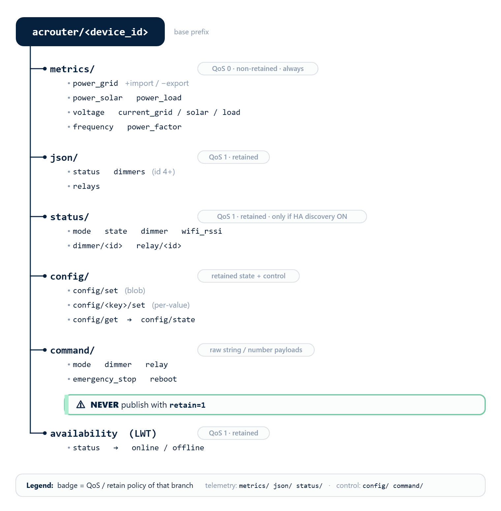

[← Sensor Calibration](https://www.rbdimmer.com/acrouter-sensor-calibration) | [Contents](https://www.rbdimmer.com/acrouter-what-is) | [Next: Home Assistant Integration →](https://www.rbdimmer.com/acrouter-home-assistant-integration)

# MQTT Guide

> **Optional.** MQTT is only needed for a broker-based dashboard, Home Assistant, or a **headless
> C2-MQTT** device. If you use the web app or REST API on an ESP32 / C2-HTTP build, you can skip MQTT
> entirely — the router works without a broker.

ACRouter publishes telemetry and accepts control and configuration over MQTT. All topics live under the
base **`acrouter/<device_id>`**.

> **Profiles.** MQTT is available on the **ESP32** and **C2-MQTT** builds. On **C2-MQTT** the device is
> **headless** — there is no HTTP server, so the broker is the *only* way in: it is provisioned,
> monitored, and controlled entirely over MQTT (see [§11.6](#116-headless-c2-mqtt)).

## 11.1 Broker Setup

Set the broker and credentials, then enable MQTT — via the serial console or `POST /api/mqtt/config`:

```text
mqtt-broker mqtt://192.168.1.10:1883
mqtt-user <name>
mqtt-pass <pass>
mqtt-device-id <id>        # sets the topic namespace acrouter/<id>
mqtt-enable
```
```bash
curl -X POST http://192.168.4.1/api/mqtt/config \
  -d '{"broker":"mqtt://192.168.1.10:1883","username":"u","password":"p","enabled":true}'
```
Check status with `mqtt-status` or `GET /api/mqtt/status`.

## 11.2 Telemetry Topics




*Everything lives under acrouter/<device_id>: metrics and JSON are telemetry, config/ configures, command/ controls (never retained).*

### Metrics — always published (QoS 0, non-retained)
| Topic | Meaning |
|-------|---------|
| `…/metrics/power_grid` | grid power (W, **+ import / − export**) |
| `…/metrics/power_solar` · `…/metrics/power_load` | solar / load power (W) |
| `…/metrics/voltage` | line voltage (V) |
| `…/metrics/current_grid` · `current_solar` · `current_load` | per-role current (A) |
| `…/metrics/frequency` · `…/metrics/power_factor` | frequency (Hz) / PF |

### Aggregate JSON — retained (QoS 1)
| Topic | Payload |
|-------|---------|
| `…/json/status` | `mode`, `state`, `dimmer`, `wifi_rssi`, `valid` |
| `…/json/dimmers` | array of dimmers (`id`, `type`, `enabled`, `level`, `name`, `priority`, `state`) — **DimmerLink, id 4+** |
| `…/json/relays` | array of relays |

### Per-entity scalars — retained (QoS 1), **only when HA discovery is on**
`…/status/mode`, `…/status/state`, `…/status/dimmer`, `…/status/wifi_rssi`;
`…/status/dimmer/<id>` (+ `/state` ON/OFF, `/priority`); `…/status/relay/<id>` (+ `/priority`).

> 🔴 The per-entity scalar topics are published **only when Home Assistant discovery is enabled**
> (`mqtt-ha-discovery 1`) — otherwise the retained QoS-1 burst can overload the C2's limited network
> stack. For a dashboard or a third-party client, subscribe to **`…/json/*`** and **`…/metrics/*`** instead.

## 11.3 Config over MQTT

The device subscribes to these for headless provisioning and remote settings.

### `…/config/set` — whole-config blob (JSON)
Applies a whole-config blob and persists it to NVS. Only these keys are parsed (schema — placeholders in
`<>`, not literal JSON):

```text
{
  "control": { "control_gain": <float>, "balance_threshold": <float>, "grid_current_limit_a": <float> },
  "modules": [ { "addr": <int|"0x51">, "channel": <int>,
                 "role": "grid|solar|load|voltage|dimmer|relay|none", "name": "<string>" } ],
  "dimmers": [ { "id": <uint8>, "priority": <0-255>, "nominal_power_w": <uint16>, "name": "<string>" } ]
}
```
Example (valid JSON):
```json
{"control":{"control_gain":100,"balance_threshold":20,"grid_current_limit_a":16},
 "modules":[{"addr":"0x51","channel":0,"role":"grid","name":"Main"}],
 "dimmers":[{"id":4,"priority":10,"nominal_power_w":2000,"name":"Boiler"}]}
```
> Only `control` / `modules` / `dimmers` are parsed — `mqtt`, `wifi`, `relays`, and `modules[].ct_model`
> are **silently ignored**. So the blob does **not** configure WiFi or the broker (see the bootstrap note
> in [§11.6](#116-headless-c2-mqtt)). Values under `control` are **range-clamped** to the same limits as
> the REST API (control_gain 10–1000, balance_threshold 0–100, grid_current_limit 0–100).
> 🔴 **Same parameter, two key names:** the GRID_LIMIT cap is **`grid_current_limit`** in the REST API
> (`/api/config`) but **`grid_current_limit_a`** here in MQTT (`config/set` blob and `config/state`).
> Default 16.0 A, range 0–100. It is the **only** way to set the cap over MQTT — there is no
> `config/grid_current_limit/set` per-value topic.

### `…/config/<name>/set` — one value (raw number, not JSON)
| `<name>` | payload | range |
|----------|---------|-------|
| `control_gain` | float | 10–1000 |
| `balance_threshold` | float | 0–100 |
| `manual_level` | int | 0–100 |
| `publish_interval` | int | 1000–60000 (ms) |

Publish `100` to `…/config/control_gain/set`. Out-of-range values are silently dropped. (The GRID_LIMIT
cap has no per-value topic — set it via the `config/set` blob's `grid_current_limit_a`, above.)

### `…/config/get` → `…/config/state`
Publish to `…/config/get` (payload ignored) and the device republishes the retained
**`…/config/state`** (QoS 1, retained), carrying only `control`:
```json
{"control":{"control_gain":100.0,"balance_threshold":10.0,"grid_current_limit_a":16.0}}
```
> `config/state` currently carries only `control` — `modules[]` / `dimmers[]` are not published in it yet.

## 11.4 Command Topics

Publish to `acrouter/<device_id>/command/…`. **Payloads are raw strings/numbers, not JSON.**

| Topic | Payload | Action |
|-------|---------|--------|
| `…/command/mode` | `off·auto·eco·offgrid·manual·boost·grid_limit` (case-sensitive) | Set the operating mode. This is also the Home Assistant Mode-select command topic |
| `…/command/dimmer` | `0`–`100` | Set the router **MANUAL** level (not a specific dimmer) |
| `…/command/relay/<id>` | `ON` / `OFF` / `TOGGLE` (case-insensitive) | Control relay `id` — **functional 0–3** (higher ids accepted but not implemented), debounced |
| `…/command/relay/<id>/priority` | int `0`–`255` | Set relay priority |
| `…/command/reboot` | any | Restart the device |
| `…/command/emergency_stop` | any | Emergency stop |
| `…/command/refresh` | any | Republish everything |

> 🔴 **Per-dimmer command topics** `…/command/dimmer/<id>` (and `/brightness`) currently address only
> the legacy GPIO range (ids 0–3) — **DimmerLink dimmers (id 4+) are not reachable through them yet** (a
> fix is in progress). For headless control today, drive the load through the router **mode**
> (`…/command/mode`) and provision with `config/set`. Mode and relay control over MQTT work fully.
> `command/emergency_stop` sets the mode to **OFF**, zeroes **all** dimmers, and **force-opens all
> relays** (the whole cascade is de-energized). It does **not** latch — the next mode command resumes.
> There is no REST equivalent; the serial equivalent is `router-mode off` (OFF also clears all dimmers
> and relays).

> 🔴 **Never publish command topics with `retain=1`.** A retained `command/reboot` or `command/mode`
> would be re-delivered every time the device (re)connects — potentially a boot loop. Publish all
> `command/*` with **retain=0**.

## 11.5 Availability & Reconnect

- **Last Will (LWT) / availability:** the device publishes to `acrouter/<device_id>/status/online` —
  **`online`** (retained) on connect, **`offline`** on graceful disconnect and as the retained LWT
  (QoS 1). Home Assistant discovery configs reference this as their `availability_topic`, so entities go
  *unavailable* when the device drops. (There is no `expire_after`.)
- **On (re)connect the device republishes everything automatically** — availability, `json/*`,
  `status/*`, `metrics/*`, `config/state`, and the HA discovery configs (all retained). You do **not**
  need `command/refresh` after a reconnect; it exists only to force a manual republish.

## 11.6 Headless C2-MQTT

On the **C2-MQTT** profile there is no HTTP config UI — everything runs through the broker.

> **Bootstrap first (serial).** The `config/set` blob does **not** set WiFi or broker credentials, so a
> factory device can't reach the broker on its own. Do the one-time bootstrap over the **serial console**
> — `wifi-connect …` and the `mqtt-broker` / `mqtt-user` / `mqtt-pass` / `mqtt-enable` commands (see
> [Terminal Commands](https://www.rbdimmer.com/acrouter-terminal-commands)). Once it connects to the
> broker, everything else is done over MQTT.

Then, over the broker:

- **Provision** roles, module addresses, and control settings with a `…/config/set` blob.
- **Monitor** via `…/metrics/*` and `…/json/*`.
- **Control** via `…/command/*` (mode, relays) and `…/config/<name>/set`.

This lets a low-cost ESP32-C2 run fully headless after the serial bootstrap.

---

[← Sensor Calibration](https://www.rbdimmer.com/acrouter-sensor-calibration) | [Contents](https://www.rbdimmer.com/acrouter-what-is) | [Next: Home Assistant Integration →](https://www.rbdimmer.com/acrouter-home-assistant-integration)
