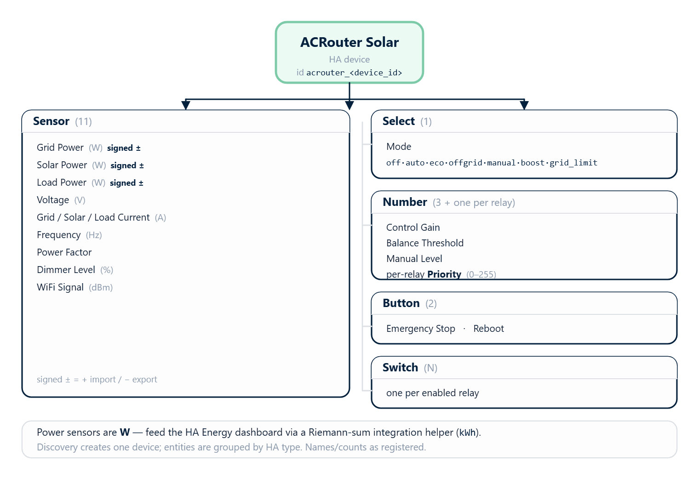

[← MQTT Guide](https://www.rbdimmer.com/acrouter-mqtt-guide) | [Contents](https://www.rbdimmer.com/acrouter-what-is) | [Next: Glossary →](https://www.rbdimmer.com/acrouter-glossary)

# Home Assistant Integration

> **Optional.** Home Assistant is one way to monitor and control ACRouter. Skip this page if you use the
> web app or the REST API — the router works fully without Home Assistant.

ACRouter integrates with Home Assistant over **MQTT auto-discovery** — enable it and the entities appear
automatically, no YAML.

## 12.1 Setup

1. Configure the MQTT broker and enable MQTT — see the [MQTT Guide](https://www.rbdimmer.com/acrouter-mqtt-guide).
   Use the same broker as your Home Assistant MQTT integration.
2. Enable discovery: `mqtt-ha-discovery 1` (or `POST /api/mqtt/config {"ha_discovery":true}`).
3. The device publishes retained discovery configs under
   `homeassistant/<component>/acrouter_<device_id>/<uniqueId>/config`; Home Assistant creates the
   entities under a device identified by `acrouter_<device_id>` (its display name is **"ACRouter Solar"**,
   or whatever you set as the MQTT `device_name`).

## 12.2 Registered Entities

*Discovery creates one 'ACRouter Solar' device with sensors, a mode select, number controls, buttons, and one switch per relay.*

| Type | Entities |
|------|----------|
| **Sensor** (11) | Grid Power · Solar Power · Load Power (W) · Voltage (V) · Grid / Solar / Load Current (A) · Frequency (Hz) · Power Factor · Dimmer Level (%) · WiFi Signal (dBm) |
| **Select** (1) | **Mode** — `off · auto · eco · offgrid · manual · boost · grid_limit` |
| **Number** (3 + one per enabled relay) | Control Gain · Balance Threshold · Manual Level · per-relay **Priority** (0–255) |
| **Button** (2) | Emergency Stop · Reboot |
| **Switch** | one per enabled relay |

The Grid/Solar/Load Power sensors are **signed** (import +, export −). They land in Home Assistant's
**History** and **Statistics** and are perfect for graphs.

> **Energy dashboard note.** These are **power** sensors (W). The Home Assistant **Energy** dashboard
> needs **energy** sensors (kWh, `state_class: total_increasing`) — you cannot add a power sensor to it
> directly. To feed the Energy dashboard, add a **Riemann-sum integration** helper in HA to turn each
> power sensor into an energy sensor (e.g. `sensor.acrouter_grid_energy` from `sensor.acrouter_grid_power`).

> ⚠️ **Dimmer control from Home Assistant is not available yet.** In the current v2.0 firmware,
> DimmerLink dimmer outputs (id 4+) do **not** register as Home Assistant light entities (a discovery fix
> is in progress) — and the per-dimmer MQTT command topics don't reach them either. Control the load
> through the **Mode** select (AUTO/BOOST/…) — that drives the DimmerLink normally. The **Manual Level**
> number and MANUAL mode set the overall dimmer level. Direct per-dimmer control comes with the fix.

## 12.3 Using It

- **Monitor** — add the power/voltage/current/frequency sensors to a Lovelace dashboard (for the Energy
  dashboard, first create Riemann-sum energy helpers — see §12.2).
- **Control the mode** — the **Mode** select switches AUTO/ECO/OFFGRID/… ; **Emergency Stop** and
  **Reboot** buttons act immediately.
- **Tune** — the Control Gain / Balance Threshold / Manual Level numbers adjust the controller.
- **Automate** — e.g. switch to BOOST on a cheap-tariff schedule, or to ECO when export isn't wanted.

## 12.4 Changed from v1.x

Sensors now come from the smart **rbAmp** modules and the mode set has grown to seven (adding
GRID_LIMIT). The v1.x GPIO/TRIAC dimmer and on-chip ADC topics are gone — dimming is DimmerLink-based.

---

[← MQTT Guide](https://www.rbdimmer.com/acrouter-mqtt-guide) | [Contents](https://www.rbdimmer.com/acrouter-what-is) | [Next: Glossary →](https://www.rbdimmer.com/acrouter-glossary)
